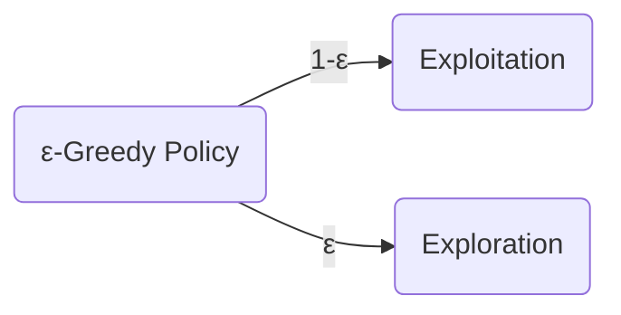

Created on: 24-11-2025 16:11, note by Youssef Okeil
Status: #idea
Tags: #AI/reinforcement-learning
# Epsilon-Greedy Function
> is a policy that handles the [[Exploration-Exploitation trade-off]], by assigning a value for the level of exploration, namely, $\Large\epsilon$. 

## $\Large\epsilon$-Greedy Policy

- *Exploitation:* using a greedy strategy to maximize reward
- *Exploration* choosing a random action.

-----------------
# References
[[Reinforcement Learning Hugging Face]]