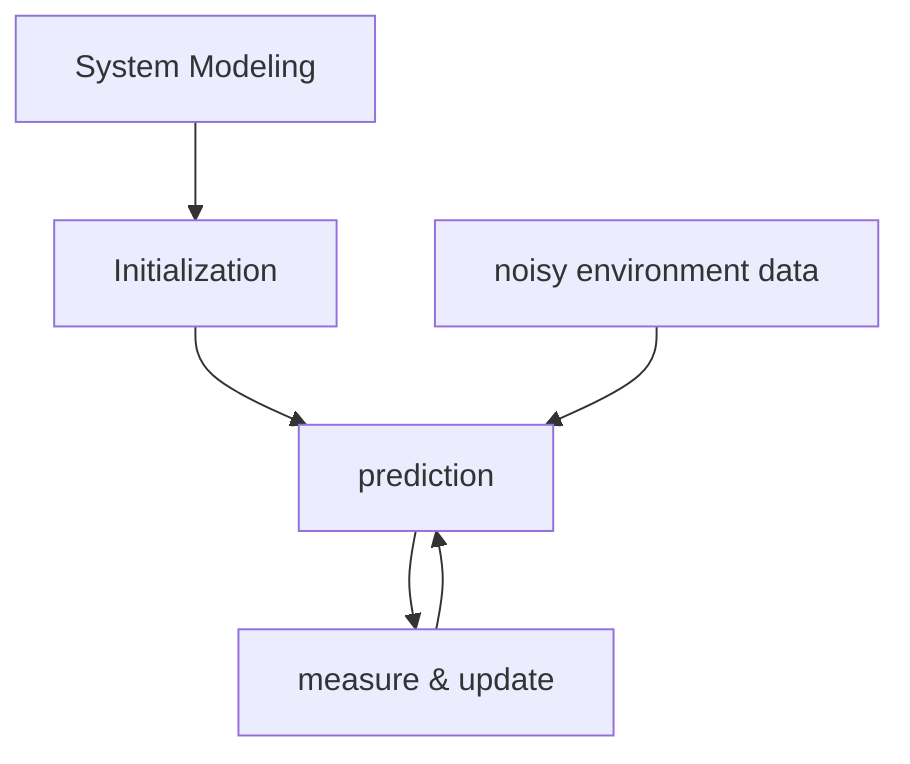

# Kalman Filter
### What are Kalman Filters?
Kalman Filter is a mathematical algorithm that estimates state in a noisy environment. It uses an averaging technique that combines predictions with observations, to get the state of a variable with greater accuracy. 
#### Requirements:
- the system must be linear, if it's not linear we use the Extended Kalman Filter 
- noise can be modeled as gaussian noise
### Steps:
1. **System modeling:** you model the system by defining
	- state vector (x): variables that describe system's state, for localization those may be position and velocity
	- state transition matrix (F): how the state evolves from one step to the next
	- control input matrix (B) and vector (u): how known inputs affect the state
	- observation matrix (H): how measurements relate to the state
	- Noise covariance matrices (Q and R): statistical properties of the process and measurement noise
	- $$K_{t}: \text{kalman gain}$$
2. **Initialization:** initialize the filter with
$$\hat{x}_{0|0}  \text{ initial state estimate (best guess)}$$
$$P_{0|0}  \text{ initial error covariance matrix (uncertainty of initial guess)}$$
3. **Prediction:** for each time step *t*, predict current state and error covariance
$$\hat{x}_{t|t-1} = F.\hat{x}_{t-1|t-1} + B.u_{t-1}$$
$$P_{t|t-1} = F.P_{t-1|t-1}. F^T + Q$$
4. **Measure and Update:** when a measurement *z* at time step *t* is available we update the estimate
$$K_{t} = P_{t|t-1}.H^{T}.(H.P_{t|t-1}+R)^{-1}$$
$$\hat{x}_{t|t} = \hat{x}_{t|t-1} + K_{t}.(z_{t}-H.\hat{x}_{t|t-1})$$
$$P_{t|t} = (I - k_{t}.H). P_{t|t-1}$$
5. **Go to step 3**, at time step *t+1*

### Kalman in Self-Driving cars:
#### States:
$$x_{pos}, y_{pos}, z_{pos} : \text{x, y \& z coordinates}$$
$$\dot{x}, \dot{y}, \dot{z}: \text{velocity in x, y \& z directions}$$
$$\ddot{x}, \ddot{y}, \ddot{z}: \text{acceleration in x, y \& z directions}$$
#### Sensors:
- for x, y & z coordinates, I'll use a **GPS**
- for speeds I'll use a **speedometer**
- for acceleration we'll use the **Inertial Measurement Unit (IMU)**, which calculates acceleration along X, Y, Z axes

# SLAM
SLAM is a popular method that makes it possible to estimate the map. It stands for simultaneous localization and mapping. This is very useful for things like parking a self-driving car. 

### Types of SLAM:
#### Visual SLAM:
uses images from cameras (wide angle, fish-eye or spherical cameras). Or compound eye cameras (stereo and multi cameras).

It can be implemented at a very low cost with relatively inexpensive cameras. They can be used to detect landmarks.

#### LiDAR SLAM
using LiDAR sensors, which are more precise, we then use the point cloud data (x, y, z) for map estimation. 

Laser sensor point cloud data provides high-precision distance measurements.

#### Multi-sensor SLAM
utilize a variety of sensors: **IMU, GPS, LiDAR, Radar**. This enhances precision and robustness of SLAM algorithms.

### SLAM Algorithms:
The statistical problem is to find the agent's state $x_{t}$ and map of the environment $m_{t}$ given sensor observations $o_{t}$ and series of controls $u_{t}$. This can be mapped as a Bayesian problem.

$$P(m_{t+1}, x_{t+1}| o_{1:t+1}, u_{1:t})$$
to estimate agent's state and map of the environment, statistical techniques are used like Kalman filters and particle filter (Monte-Carlo Localization). 