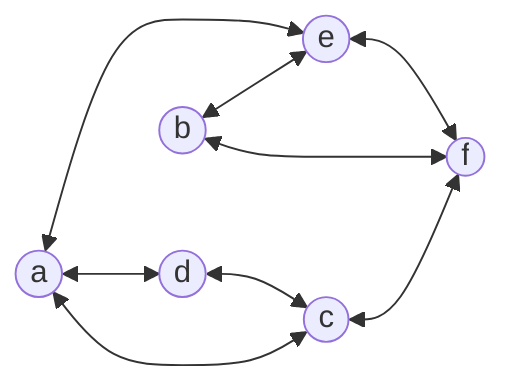
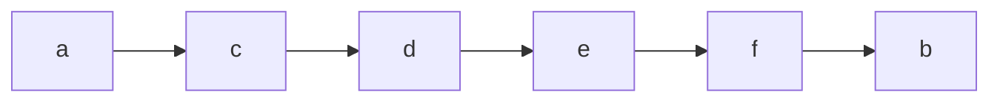
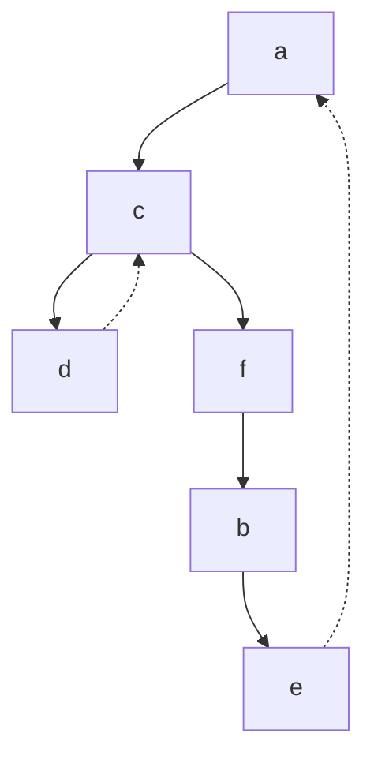
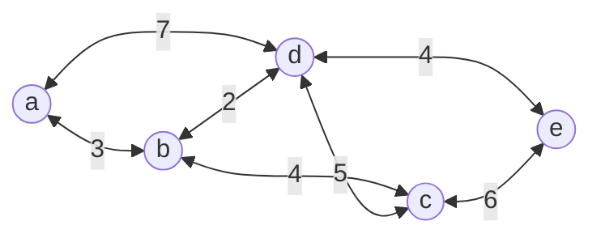
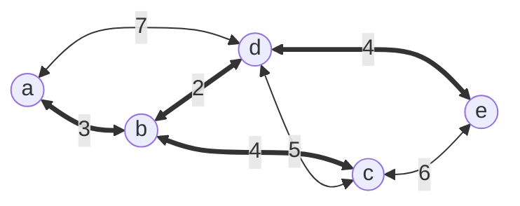
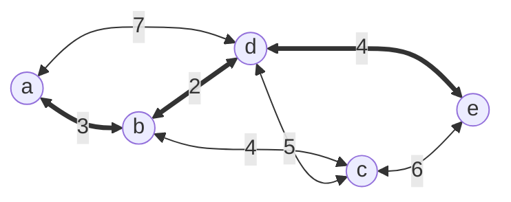

# Graph Search Algorithms
Graph searching algorithms are the cornerstone of path planning algorithms, the most popular of which are: BFS, DFS, Dijkstra’s and A\* algorithms 
  
- Briefly describe how each of those algorithms work.  
- Mention the pros and cons of each algorithm.  

## Breadth-First Search
breadth-first search, is a graph traversal algorithm that 
1. visits all vertices that are adjacent to a starting vertex, 
2. then all the unvisited vertices two edges apart from it.
3. If there are still unvisited vertices, the algorithms starts at an arbitrary vertex.
#### Traversal Example
for the graph:

we start with *a*, then visit its neighbors *c*, *d* then *e*. Then we shift to *c* and visit its neighbors *d* (marked as visited) so we go to *f*. Then we go to *f* etc.

**Traversal Queue:**

It is convenient to use the **queue** data structures when handling BFS.
1. we initialize the queue with the traversal's starting index.
2. On each iteration the algorithm identifies all unvisited vertices that are adjacent to the front index
3. The algorithm then marks those vertices as visited and adds them to the queue
4. when we finish visiting all of the neighbors of the front index, the front index is popped. Then we go to *step 1*
### Pros:
- Has low time-complexity of $\Theta(|V|^2)$ for the adjacency matrix implementation &  *${\Theta(|V|+|E|)}$* for the adjacency list implementation where |V| are graph vertices, |E| are edge vertices.
- It can be used for minimum-edge paths finding. To do this, we start with the we start the BFS traversal at one of the two vertices and stop when the other is reached. 
	- for our example above the minimum between *a* and *d*, is *a -- c -- d*
### Cons:
- can't be used for articulation points.
- doesn't work with weighted graphs.
- is only a graph traversal algorithm.
-----------
## Depth-First Search
depth-first search, is a graph traversal algorithm that 
1. starts with a vertex 
2. The algorithm proceeds to an unvisited vertex that is adjacent to the one it is currently in.
3. this process continues until the algorithm finds a dead end, when he backs up one vertex and tries to visit the unvisited vertices there.
4. The algorithm terminates after backing up to the starting vertex.
5. If still there are vertices not visited, we start with one of them by random.
#### Traversal Example
for the same graph:

**Traversal Queue:**

It is convenient to use the **stack** data structures when handling DFS.
1. we push a vertex onto the stack when the vertex is visited the first time.
2. we pop a vertex when it becomes a dead end
### Pros:
- Similar to BFS time-complexity of $\Theta(|V|^2)$ for the adjacency matrix implementation &  *${\Theta(|V|+|E|)}$* for the adjacency list implementation.
- Algorithm is very brief and simple.
- It can be used to find **articulation points**, which are vertices that by its removal the graph breaks into disjoint sets.
- Can be used to find vertices that are so deep in the graph.
### Cons:
- can't be used for minimum-edge paths finding.
- doesn't work with weighted graphs.
- is only a graph traversal algorithm.
---------------
## Dijkistra's Algorithm
Dijkistra's algorithm, is a graph traversal algorithm that; for a given source in a weighted connected graph, we find shortest paths to all its other vertices. It finds the shortest paths to a graph's vertices in order of their distance from the given source:
1. Finds the shortest path from the source to the vertex nearest to it.
2. Then the second nearest and so on.
3. Every iteration, the algorithm updates the path data it has. 
In the $i^{th}$ iteration of the algorithm, the algorithm would've already identified shortest paths to $i-1$ vertices nearest to the source, making a subtree $T_i$ of the source and those vertices.
 

#### Traversal Example
for the graph:

**Traversal Steps:**

| Tree Vertices | Remaining Vertices                                   | illustration        |
| ------------- | ---------------------------------------------------- | ------------------- |
| a(-,0)        | **b(a,3)**, c(-, $\infty$ ), d(a, 7), e(-, $\infty$) | a -> b              |
| b(a,3)        | c(b, 3+4 ), **d(b, 3+2)**, e(-, $\infty$)            | a -> b-> d          |
| d(b, 3+2)     | **c(b, 7)**, e(d, 5+4)                               | a -> b -> d, b -> c |
| c(b, 7)       | **e(d,9)**                                           | a->b->d->e, b->c    |
| e(d, 9)       | ---                                                  |                     |
**Final Illustration:**

### Pros:
- Has low time-complexity of $\Theta(|V|^2)$ for the weight matrix implementation with priority queue as array &  *${\Theta(|E|. log(|V|))}$* for the priority queue implementation as min-heap ad adjacency lists.
- works with weighted graphs (of positive values only).
### Cons:
- The algorithm is harder to implement than the above algorithms.
------
## A* Algorithm
Is an extension of dijkistra's algorithm. It finds the shortest path from a specified source to a specified goal and not from a specified source to all possible goals. It uses [[Heuristics]] to guide its search. 

>Heuristics can be considered an approximation or an assumption that is not entirely correct, and the point of it is to solve the problem.

It uses the cost start node to current node (g), the heuristic estimate of the cost from the current node to the goal (h) and sums them together (f). 
- $g(n)$ cost from start node to current node n
- $h(n)$ heuristic estimate of cost from current node to goal
- $f(n)=g(n)+h(n)$ the total estimated cost to be minimized.
### The Algorithm:
1. Initialize open and closed list. 
2. Select node with the lowest $f(n)$
3. Check if the selected node is goal node, if so then break and reconstruct the path
4. For each neighbor of the node, calculate g, h and f values. 
	- If neighbor not in open list, add it
	- If neighbor is in open list, update f value if it smaller than its recorded f value
5. If open list is empty, break. Else, go to *step 2*.
#### Path-finding Example
for the graph, what is the minimum path between $a$ and $e$ ?

| h(n) | value |
| ---- | ----- |
| h(b) | 7     |
| h(d) | 4     |
| h(c) | 6     |

**Path-finding Steps:**

| Tree Vertices | $f(n) =g(n)+h(n)$    | illustration     |
| ------------- | -------------------- | ---------------- |
| a(-,0)        | **f(b)=10**, f(d)=11 | a -> b           |
| b(a, 3)       | **f(d)=6,** f(c)=10  | a -> b -> d      |
| d(b, 5)       | **f(e)=4**,f(c)=10   | a -> b -> d -> e |
| e(d, 9)       | --                   | --               |
Notice that we obtained the same result as the above dijkistra algorithm in one less step, as we didn't traverse the whole graph. While the heuristic wasn't perfect and I didn't actually calculate it, it was an estimate I calculated in my mind!

**Final Illustration:**

 

### Pros:
- **Completeness:** A* is complete, meaning it will always find a solution if it exists.
- **Optimal:** it doesn't overestimate the true cost to reach goals
- **Efficiency:** when the heuristic is well-designed, it reduces the number of nodes that need to be explored.
- Time complexity is worst-case of $O(b^d)$, where $b$ is the branching factor and $d$ is the depth of the shortest path.
### Cons:
- Space complexity can be a limiting factor in large graphs as it has a space complexity of $O(b^d)$.
------------
# Practical Motion Planning
A Vaccum cleaning robot uses A\* algorithm to navigate its way through the house, however the paths it navigates are often too rough (Zig-Zag).
### My Solution:
Add a penalty to the path-finding algorithm whenever it changes direction.

### The risk:
The vacuum cleaning robot will find an issue in cleaning small rooms, or places of maze like structure than need a lot of direction changes.
  

# References
Examples are from *Introduction to Design and Analysis of Algorithms by Anany Levitin.*