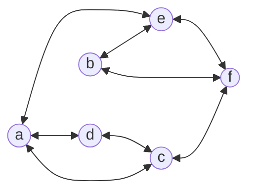
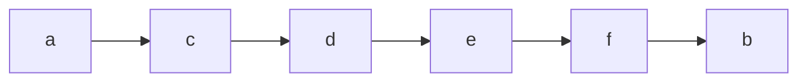

Created on: 03-11-2025 23:27, note by Youssef Okeil
Status: #idea
Tags: #AI #algorithms 
# Breadth-First Search
breadth-first search, is a graph traversal algorithm that 
1. visits all vertices that are adjacent to a starting vertex, 
2. then all the unvisited vertices two edges apart from it.
3. If there are still unvisited vertices, the algorithms starts at an arbitrary vertex.
#### Traversal Example
for the graph:

we start with *a*, then visit its neighbors *c*, *d* then *e*. Then we shift to *c* and visit its neighbors *d* (marked as visited) so we go to *f*. Then we go to *f* etc.

**Traversal Queue:**

It is convenient to use the **queue** (FIFO) data structures when handling BFS.
1. we initialize the queue with the traversal's starting index.
2. On each iteration the algorithm identifies all unvisited vertices that are adjacent to the front index
3. The algorithm then marks those vertices as visited and adds them to the queue
4. when we finish visiting all of the neighbors of the front index, the front index is popped. Then we go to *step 1*
### Pros:
- Has low time-complexity of $\Theta(|V|^2)$ for the adjacency matrix implementation &  *${\Theta(|V|+|E|)}$* for the adjacency list implementation where |V| are graph vertices, |E| are edge vertices.
- It can be used for minimum-edge paths finding. To do this, we start with the we start the BFS traversal at one of the two vertices and stop when the other is reached. 
	- for our example above the minimum between *a* and *d*, is *a -- c -- d*
### Cons:
- can't be used for articulation points.
- doesn't work with weighted graphs.
- is only a graph traversal algorithm.

## Complexity:
**Time Complexity:** 
$\Large{O(b^d)}$
**Space Complexity:**
$\Large{O(b^d)}$
b: branching factor, d: shortest solution length

-----------------
# References
[[AI: A Modern Approach]], 