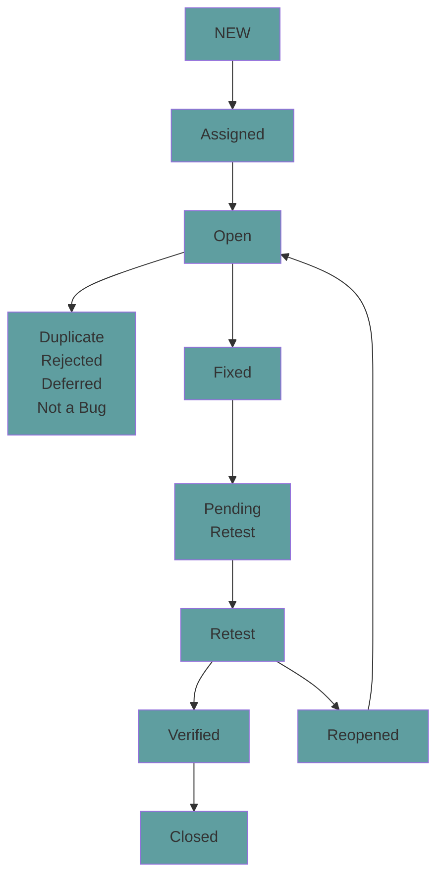

Created on: 10-11-2025 15:53, note by Youssef Okeil
Status: #idea
Tags: #software
# Defects
> defect, incident, bug, issue are all referring to the same concept. Defect happens when *expected results* are different from *actual results*.

## Defect Report

| **Defect Parameter** | **Description**                                  |
| -------------------- | ------------------------------------------------ |
| **Defect ID**        | Unique identifier for the defect                 |
| **Description**      | Detailed info including the module affected      |
| **Version**          | Application version where defect was found       |
| **Steps**            | Steps (with screenshots) to reproduce the defect |
| **Date**             | Date the defect was reported                     |
| **Reference**        | Related documents (requirements, design, etc.)   |
| **Reported by**      | Tester's name                                    |
| **Status**           | Current status of the defect                     |
| **Fixed by**         | Developer who resolved the defect                |
| **Date Closed**      | Date the defect was closed                       |
| **Severity**         | Impact level of the defect                       |
| **Priority**         | Urgency of fixing the defect                     |
**Difference between *severity* and *priority*:**
- **severity:** the extent to which a defect affects the application.
- **priority:** based on business needs and severity of the defect

-----------
## Defect States:

---------
## Defect Management Process:
1. **Discovery**, 
	1. *discover defect:* detect the defect before releasing to customer. 
	2. *report defect:* report defect to development team.
	3. *accept defect:* developer accepts or rejects the bug.
2. **Categorization**
	put the defect in a category of priority {Critical, High, Medium, Low}
3. **Resolution**
	1. *Assignment:* once a defect assigned for fix
	2. *Schedule fixing:* developer schedules fixes based on defect priority
	3. *Fix the defect:* manager monitors defect resolution
	4. *Report the resolution:* obtain resolution report after fix
4. **Verification**
	testing team verifies fixes
5. **Closure** 
	defects are marked as closed or unresolved.
	if unresolved, test manager notifies development.
6. **Reporting**
	management board has access to defect status and give feedback.

## Defect Metrics
1. **Defect Rejection Ratio (DRR)**
	by rejecting the *false-positives* 
	$$\text{Defect Rejection Ratio}= \frac{\text{no of defects rejected}}{\text{total no. of defects raised by testing team}}*100$$
	Ex: out of 84 defects, 64 are actually defects. --> (20/84)\*100
2. **Defect Leakage Ratio (DLR)**
	measuring the *false-negatives*
	$$\text{Defect Leakage Ratio}= \frac{\text{no of defects missed}}{\text{total no. of defects raised by testing team}}*100$$
	Ex: out of 80 defects, we detected only 60 defects. --> (20/80)\*100
>NB: we need both false-positives (DRR) and false-negatives (DLR) to be as low as possible.
-----------------
# References
[[Courses/Software Testing|Software Testing]]