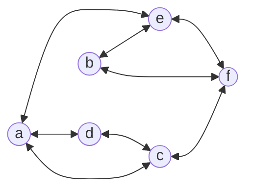
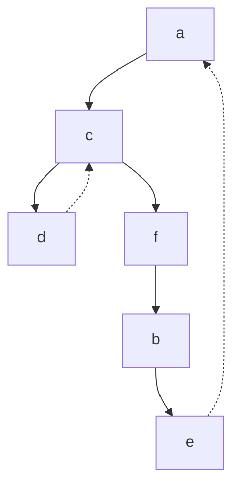

Created on: 03-11-2025 23:28, note by Youssef Okeil
Status: #idea
Tags: #AI #algorithms 
# Depth-First Search
depth-first search, is a graph traversal algorithm that 
1. starts with a vertex 
2. The algorithm proceeds to an unvisited vertex that is adjacent to the one it is currently in.
3. this process continues until the algorithm finds a dead end, when he backs up one vertex and tries to visit the unvisited vertices there.
4. The algorithm terminates after backing up to the starting vertex.
5. If still there are vertices not visited, we start with one of them by random.
#### Traversal Example
for the same graph:

**Traversal Queue:**

It is convenient to use the **stack** (LIFO) data structures when handling DFS.
1. we push a vertex onto the stack when the vertex is visited the first time.
2. we pop a vertex when it becomes a dead end
### Pros:
- Similar to BFS time-complexity of $\Theta(|V|^2)$ for the adjacency matrix implementation &  *${\Theta(|V|+|E|)}$* for the adjacency list implementation.
- Algorithm is very brief and simple.
- It can be used to find **articulation points**, which are vertices that by its removal the graph breaks into disjoint sets.
- Can be used to find vertices that are so deep in the graph.
### Cons:
- can't be used for minimum-edge paths finding.
- doesn't work with weighted graphs.
- is only a graph traversal algorithm.

## Complexity
**Time Complexity:** 
$\Large{O(b^m)}$
**Space Complexity:**
$\Large{O(b.m)}$
b: branching factor, m: maximum depth for depth-first search

-----------------
# References
[[AI: A Modern Approach]]