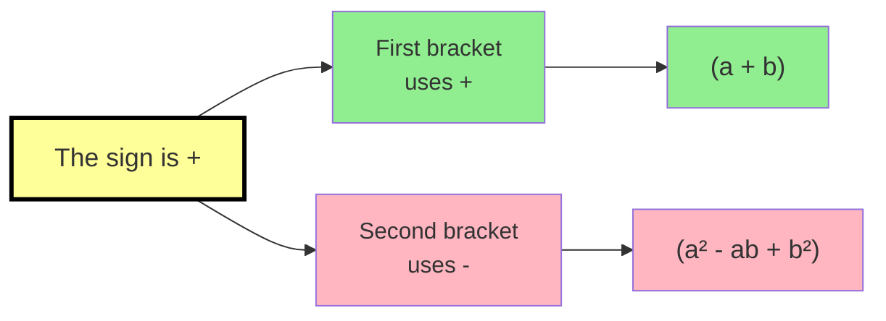
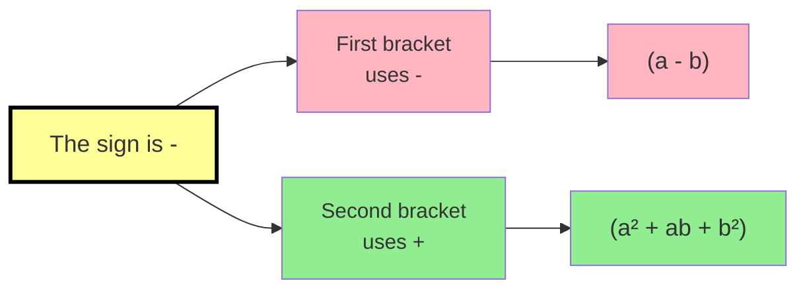

## 4) Special Case: Difference between two squares
لاحظ انها رقمين بس
$$a^{2}-b^{2}= (a-b)(a+b)$$

Example:
$$x^{2}-25$$
$$(x-5)(x+5)$$

#### Solve It Yourself (5)
5. Factorize $49x^{4}-1$
...............................................................................................................................
..............................................................................................................................
..............................................................................................................................
## Special Case: Sum & Difference between two cubes
**Sum of 2 Cubes**
$$a^{3}+b^{3}= (a+b)(a^2-ab+b^2)$$

**Difference of 2 Cubes**
$a^{3}-b^{3}= (a-b)(a^2+ab+b^2)$

 
 

Example:
$$x^3+8$$
$$(x+2)(x^{2}-2x+4)$$

#### Solve It Yourself (6)
6. Factorize $8a^{3}-125b^3$
...............................................................................................................................
..............................................................................................................................
..............................................................................................................................
..............................................................................................................................
..............................................................................................................................
..............................................................................................................................

------