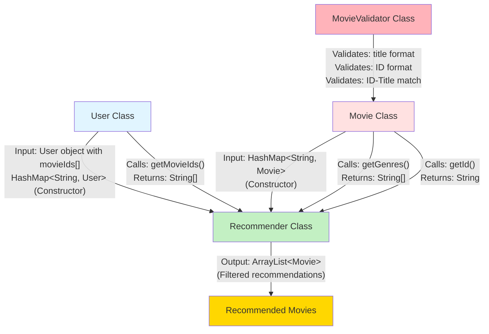

Created on: 29-11-2025 21:04, note by Youssef Okeil
Status: #idea
Tags: #software
# Testing High Level View

```mermaid
graph TD
    A[User Class] -->|"Input: User object with movieIds[]<br/>HashMap&lt;String, User&gt; (Constructor)"| B[Recommender Class]
    C[Movie Class] -->|"Input: HashMap&lt;String, Movie&gt;<br/>(Constructor)"| B
    
    E[MovieValidator Class] -->|"Validates: title format<br/>Validates: ID format<br/>Validates: ID-Title match"| C
    
    B -->|"Output: ArrayList&lt;Movie&gt;<br/>(Filtered recommendations)"| F[Recommended Movies]
    
    C -->|"Calls: getGenres()<br/>Returns: String[]"| B
    C -->|"Calls: getId()<br/>Returns: String"| B
    A -->|"Calls: getMovieIds()<br/>Returns: String[]"| B
    
    style A fill:#e1f5ff
    style B fill:#c3f0c3
    style C fill:#ffe1e1
    style E fill:#ffb3ba
    style F fill:#ffd700
```

-----------------
# References