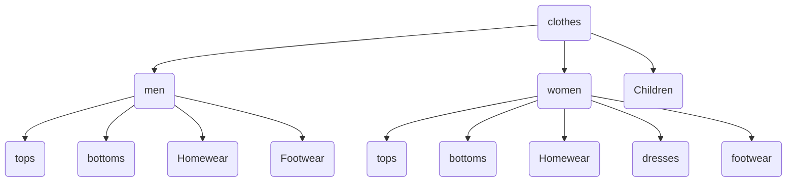

Created on: 11-11-2025 13:14, note by Youssef Okeil
Status: #idea
Tags: #BaRead
# Type & Subtypes Baread

| type    | subtype  | subtype_level |
| ------- | -------- | ------------- |
| clothes | men      | 1             |
| clothes | women    | 1             |
| men     | tops     | 2             |
| men     | bottoms  | 2             |
| men     | homewear | 2             |

-----------------
# References