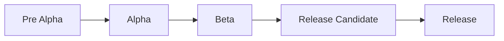

Created on: 12-11-2025 18:39, note by Youssef Okeil
Status: #idea
Tags: #software
# User Acceptance Testing
> Checks whether the software meets business requirements and is ready for delivery to end-users.
- final step of testing before release to end-users
- **black-box** testing against acceptance criteria

**Pre-Alpha:**
- Software is a prototype
- UI is complete
- Some features are still in development
- Not yet published
**Alpha**
- software is nearing completion and undergoing internal testing for bugs
**Beta**
- stable software is released to a limited user base to gather feedback and make improvements
**Release Candidate (RC)**
- Beta test feedback leads to minor functional tweaks and bug fixes
**Release**
- Software is release to public
-----------------
# References
[[Courses/Software Testing|Software Testing]]